# quickshell-bar

A complete personal Wayland desktop shell built on
[Quickshell](https://quickshell.org/), with first-class support for
**niri**, **Hyprland**, and **Sway / i3** out of the box.

Replaces (in one configurable QML codebase):
**waybar** · **swaync / mako / dunst** · **swayosd** ·
**nm-applet** · **blueman-applet** · **KDE media controls** ·
**wlogout** · **fuzzel** · **hyprlock** ·
**swaybg / waypaper** · **hypridle / swayidle** ·
**hyprpolkitagent**.

## Supported compositors

| Compositor       | Workspaces | Click-to-focus | Window focus | Layout OSD | Logout action       |
|------------------|:----------:|:--------------:|:------------:|:----------:|---------------------|
| **niri**         | yes        | yes            | yes          | yes        | `niri msg action quit` |
| **Hyprland**     | yes        | yes            | yes          | yes        | `hyprctl dispatch exit` |
| **Sway / i3**    | yes        | yes            | yes          | —          | `swaymsg exit` / `i3-msg exit` |
| Other (river, Wayfire, Cosmic, …) | — | — | — | — | — |

The shell auto-detects which compositor is running at startup
(`$HYPRLAND_INSTANCE_SIGNATURE` / `$SWAYSOCK` / `$NIRI_SOCKET` /
`$XDG_CURRENT_DESKTOP`). On unsupported compositors the bar still
loads — only the workspace indicator goes blank, every other widget
keeps working. Override detection with `QS_COMPOSITOR=niri|hyprland|sway`.

---

## Features

**Bar** (32 px top, one per monitor)
- Workspaces with focused / active / idle chip indicators (compositor-aware)
- Clock + Calendar (popup, pinnable)
- Notifications · Tray · Media · Battery · Brightness · Volume
- Control Center (drawer for less-frequent toggles)
- Power menu

**Control Center** (drawer behind the sliders icon)
- Volume + brightness sliders
- 3 × 2 tile grid: Wi-Fi · Bluetooth · Power Profile · Caffeine · DND · Wallpaper
- Tiles with chevrons drill into in-place detail views (Network list, Bluetooth devices, 3-radio profile picker)
- Tiles without chevrons toggle in place (Caffeine, DND) or open the standalone wallpaper picker
- Weather card with KNMI HARMONIE-AROME 2 km Dutch model data (via Open-Meteo)
- Now Playing card (auto-hides when no MPRIS player)

**Popups** (mutex-managed; auto-dismiss on app focus)
- Volume mixer · Notification center · Calendar · Media · Tray menus
- Power menu (lock / suspend / logout / reboot / shutdown)
- Clipboard history (Mod+V) — image-thumbnail aware
- App launcher (Mod+P) — apps + calculator + web search + emoji
- Emoji picker shortcut (Mod+;)
- Wallpaper picker (folder browse + thumbnails + per-monitor)
- Settings page — visual editor for all 33 overridable keys (colours, fonts, sizes, animations, search engine, behaviour) with live preview; opens via the gear icon in the Control Center or `qs -p . ipc call settings open`

**Notifications & OSD**
- Native NotificationServer (replaces external daemons)
- Per-monitor pinned cards
- Volume / brightness / keyboard-layout OSDs (overlay-layer; visible over fullscreen apps)

**Wallpaper** (replaces swaybg + waypaper)
- Per-monitor wallpaper, persisted across reloads
- Background-layer surface with 400 ms cross-fade on change
- Picker: folder browse, fill-mode selector, per-monitor or "All" target
- Lock screen reads from the same source — single source of truth

**Weather** (KNMI via Open-Meteo)
- Current temperature + today's high/low + feels-like + wind + humidity
- Pinned to KNMI HARMONIE-AROME 2 km Netherlands model (`models=knmi_seamless`) — authentic KNMI data without the GRIB / NetCDF / API-key tax
- 25-city NL picker baked in; first run shows "Set location"
- 15-minute auto-refresh + manual refresh button
- Click the card body to open the detail popup: scrollable 24-hour strip, 7-day forecast, sunrise/sunset

**Session lock** (Mod+Shift+X)
- `WlSessionLock` + PAM auth via `/etc/pam.d/qslock`
- Blurred wallpaper background (per-monitor, from the in-shell wallpaper module)
- Multi-monitor surfaces, persistent error state, dim-while-validating
- Hot-reload safe (survives `qs` config reloads)
- `LockedHint` propagation to systemd-logind

**Polkit agent** (replaces hyprpolkitagent)
- Native `Quickshell.Services.Polkit` — the shell is the agent
- Prompt on the focused monitor, overlay layer, exclusive keyboard
- Shake + red tint on a failed attempt; field inert while PAM checks
- Clicking outside refocuses rather than dismissing

**Idle** (replaces hypridle / swayidle)
- Native `ext-idle-notifier-v1` via Quickshell's `IdleMonitor` — no second daemon
- Two independent stages: lock, then blank the monitors. Either can be disabled
- Honours `idle-inhibit-v1`, so video playback suppresses both stages
- Caffeine tile / `qs -p . ipc call idle disable` to stay awake

---

## Screenshots

The bar — full width across one monitor (8 widgets after the Control Center declutter):


Right cluster zoomed (3× nearest-neighbor for clarity — actual rendering is sharper):

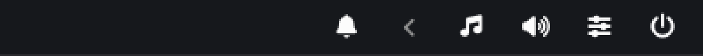

Control Center — sliders, 3 × 2 tile grid, weather card, and the optional Now Playing card:

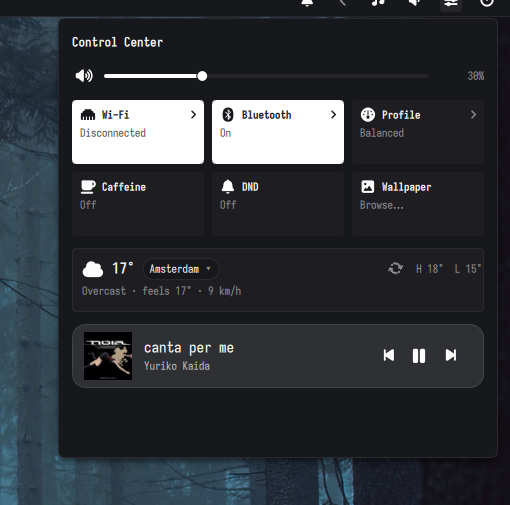

Weather detail popup — current conditions, sunrise/sunset, the next 12 hours, and a 7-day forecast (KNMI HARMONIE-AROME 2 km Dutch model via Open-Meteo):

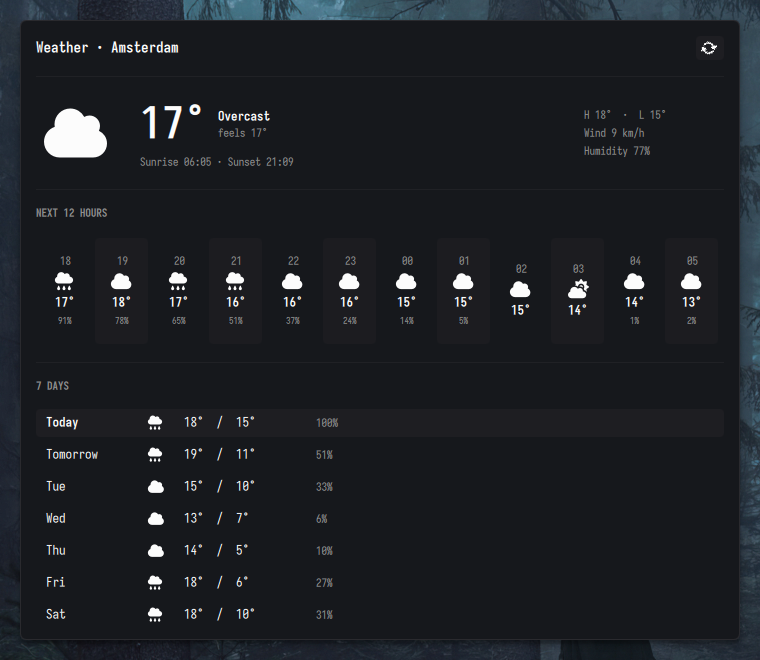

Wallpaper picker — folder browse + thumbnail grid + per-monitor target + fill-mode selector (replaces waypaper):

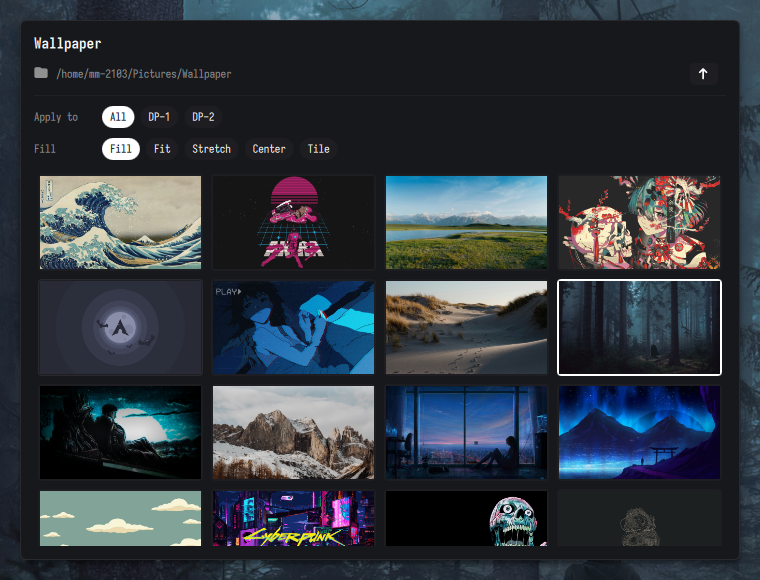

Settings page — visual editor for `~/.config/quickshell-bar/config.jsonc`. Tabs for Colours / Typography / Layout & Motion / Behaviour; sliders, hex inputs, custom HSV colour picker, search-engine presets. Live preview, debounced auto-save, `.bak` on first save:

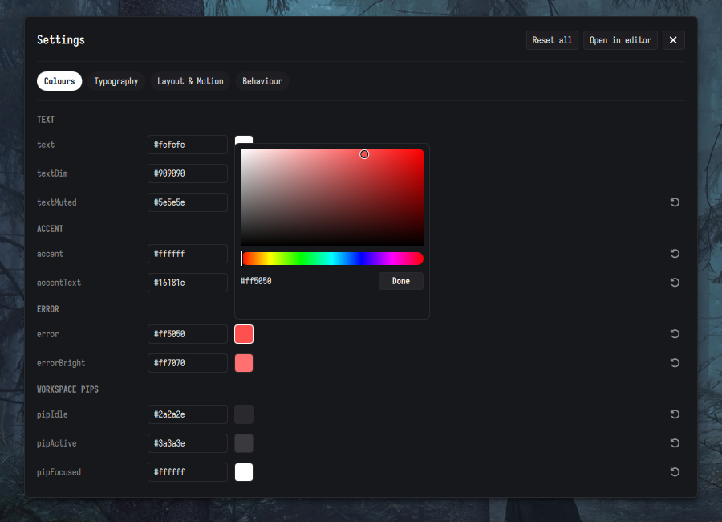

Lock screen with the now-playing card:

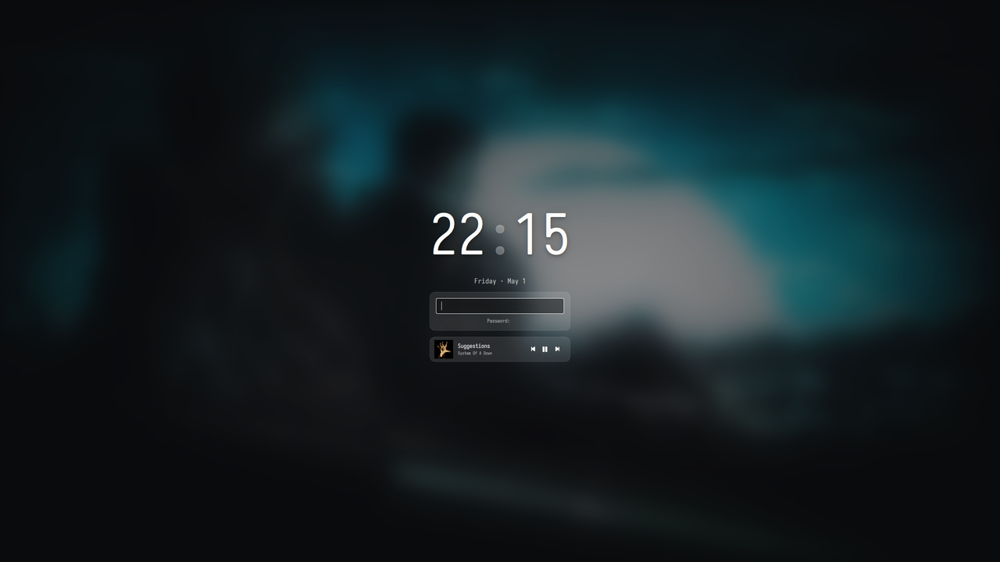

App launcher — apps mode (default), with frecency-sorted results and footer hint:

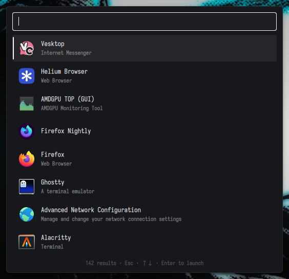

Launcher in calculator mode (`=` prefix) — copies the result on Enter:

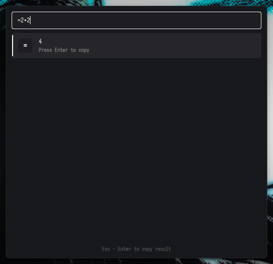

Launcher in web-search mode (`?` prefix) — opens DuckDuckGo on Enter:

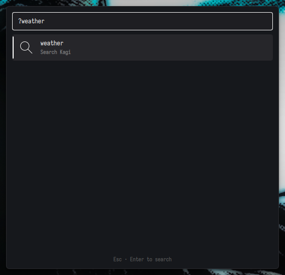

Launcher in emoji mode (`;` prefix or Mod+;) — copies the glyph on Enter:

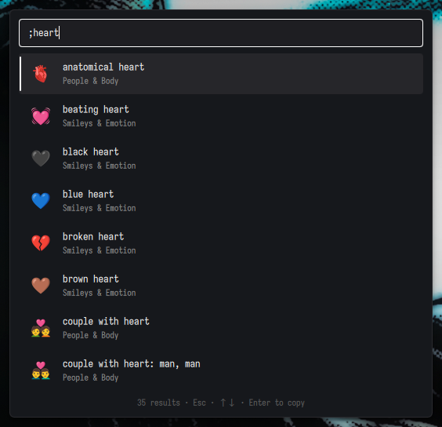

Clipboard history (Mod+V) — text + image previews, hover-revealed delete:

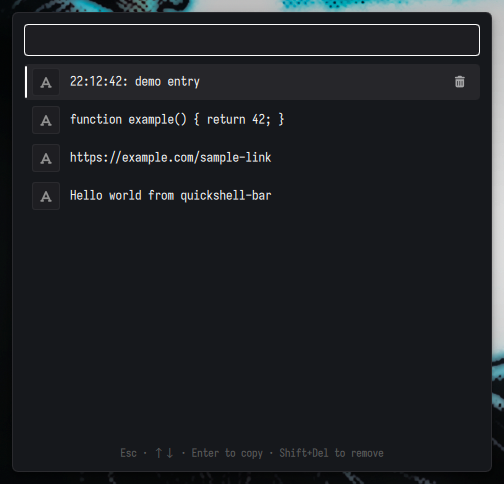

---

## Status

Personal config shared as a reference. Primary development setup:
**Arch Linux · niri 26.04 · Quickshell 0.2.1 · Qt 6.11**. Hyprland and
Sway support is implemented but tested less extensively; report any
breakage. Pre-1.0 Quickshell APIs may break between versions.

Built largely with the assistance of an LLM. Bug reports especially
welcome — a second pair of eyes from real users on Hyprland and Sway
will catch things our test pass on niri couldn't.

---

## Known limitations

- **Sway / i3**: keyboard-layout OSD silently never triggers — i3/Sway's
  IPC has no layout-changed event. Other OSDs (volume, brightness,
  caps/num lock) work normally.
- **Screen blanking needs a supported compositor.** Hyprland, niri and
  Sway are wired up via `Compositor.dispatchDpms()`; on i3 (X11) and the
  stub backend the blank stage is a silent no-op and only the lock stage
  runs.
- **Polkit agent**: only one agent per session can hold the seat, so any
  existing one (`hyprpolkitagent`, `polkit-kde-authentication-agent-1`, …)
  must be removed from autostart or ours stays silent. See
  [Polkit agent](#polkit-agent).
- **Hyprland & Sway are lightly tested.** Edge cases possible around
  named workspaces (Hyprland), multi-monitor focus tracking, and
  per-window event payloads. Bug reports very welcome.

---

## Dependencies

### Required

| Arch package           | Purpose                                         |
|------------------------|-------------------------------------------------|
| `quickshell` (AUR)     | The QML shell framework (≥ 0.3.0 — `IdleMonitor`) |
| One of: `niri` / `hyprland` / `sway` | Wayland compositor                |
| `qt6-base`             | ≥ 6.5 for `MultiEffect` (used by lock blur)     |
| `qt6-declarative`      | QML runtime                                     |
| `noto-fonts-emoji`     | Or any color-emoji font                         |
| `wl-clipboard`         | `wl-copy` for launcher's calc/emoji copy        |
| `cliphist`             | Backend for the clipboard history popup         |
| `brightnessctl`        | Backlight control (laptops only)                |
| `curl`                 | Used by the weather widget to fetch Open-Meteo  |
| Linux PAM              | Standard on any modern distro                   |

### Optional

| Arch package    | What it enables                                                        |
|-----------------|------------------------------------------------------------------------|
| `libcanberra`   | KDE-style audible cue on volume change / unmute. Plays the freedesktop `audio-volume-change` sample through the just-changed sink, so its loudness mirrors the new level. Disable via `volumeFeedbackEnabled: false` in `Theme.qml`. |
| `sound-theme-freedesktop` | Provides the actual `audio-volume-change` sample that `libcanberra` plays. Without it, canberra silently no-ops. |
| `python-gobject` | Powers `system/inhibit-bridge.py`, which owns the D-Bus `ScreenSaver` / `PowerManagement.Inhibit` names so apps can stop the idle timer. Without it, **windowed** browser video will not prevent locking — only Wayland `idle-inhibit-v1` holders will. The shell logs once and carries on if it's missing. Almost certainly already installed; it's a dependency of blueman, flatpak, gimp and others. |

---

## Installation

### 1. Clone the repo

```bash
git clone https://github.com/<you>/quickshell-bar ~/.config/quickshell/quickshell-bar
```

(Or anywhere else — substitute the path in the keybind snippets below.)

### 2. Install the PAM service file (root, one-time)

The lock screen needs its own PAM stack:

```bash
sudo install -m 644 /dev/stdin /etc/pam.d/qslock <<< 'auth include login'
```

Verify:

```bash
cat /etc/pam.d/qslock          # → auth include login
```

### 3. Wire it into your compositor

Sample configs are in `examples/` — copy the relevant snippet, replace
`/path/to/quickshell-bar` with your clone path, and reload your
compositor's config.

#### niri
Copy `examples/niri-config.kdl` into `~/.config/niri/config.kdl`. niri
auto-reloads on save.

#### Hyprland
Copy `examples/hyprland-bindings.conf` into `~/.config/hypr/hyprland.conf`
(or `source = ` it). Hyprland auto-reloads on save.

#### Sway / i3
Copy `examples/sway-bindings.conf` into `~/.config/sway/config` (or i3's
config). Reload with `swaymsg reload` / `i3-msg reload`.

That's it. Idle handling needs no setup — the shell locks at 5 min,
blanks the screens at 6 min, and locks before suspend, all out of the
box. See [Idle handling](#idle-handling) to change or disable that.

---

## Talking to the running shell

Everything scriptable goes through `qs ipc call`. One catch: **`qs` needs
to know which shell to talk to**, and it does not infer that from the
running daemon. A bare `qs ipc call …` looks for a config named
`default`, so against a `-p`-launched daemon it fails with:

```
Could not find "default" config directory or shell.qml in any valid config path.
```

Pass the same `-p` you launched with:

```sh
qs -p ~/path/to/quickshell-bar ipc call idle status
```

From inside the clone, `qs -p .` is the short version. If you use IPC
often, an alias is worth it:

```sh
alias qsb='qs -p ~/path/to/quickshell-bar'
qsb ipc call idle status
```

The snippets below spell out `-p` so they are copy-pasteable. So do the
keybind samples in [`examples/`](examples/) — substitute your clone path
there too.

---

## Polkit agent

The shell is its own polkit authentication agent
(`Quickshell.Services.Polkit`), so privileged actions — `pkexec`,
`systemctl`, GParted, a package manager GUI — prompt inside the shell
instead of needing `hyprpolkitagent` or a KDE/GNOME agent.

**Remove any existing agent from autostart first.** Only one agent per
session can hold the seat, and whichever registers first wins. If another
is running, ours stays silent and logs:

```
[PolkitService] not registered — another polkit agent probably holds the
session (hyprpolkitagent, polkit-kde-authentication-agent-1, ...)
```

On Hyprland that usually means deleting a line like this from your config:

```lua
hl.exec_cmd("/usr/lib/hyprpolkitagent/hyprpolkitagent")
```

Verify with `qs -p . log -t 50 | grep PolkitService` — you want
`registered at /org/quickshell_bar/PolkitAgent`. Each request is logged
with its action id, which is the quickest way to answer "why did a
password prompt just appear".

Behaviour worth knowing:

- **Clicking outside refocuses instead of dismissing.** Losing a
  half-typed password to a stray click is worse than pressing Escape.
- **Escape twice cancels.** The first press asks for confirmation, and the
  hint line says why:

  > Esc again to cancel — counts as a failed attempt

  Abandoning a polkit prompt makes `pam_unix` fail and `pam_faillock`
  count it, on *any* agent — polkit starts the PAM conversation the moment
  the prompt appears. At the default `deny=3`, three stray Escapes lock
  the account for 10 minutes, TTYs included. Nothing in polkit warns you,
  so the second press exists to stop a mistaken keypress spending one of
  your three. Inspect or clear the counter with:

  ```sh
  faillock --user $USER
  sudo faillock --user $USER --reset
  ```
- The field goes inert while a submission is in flight and during the
  1.2 s error flash, so you can't type into a request that's already gone.

Fingerprint unlock is not implemented — the lock screen doesn't do it
either, and there's no reader on the development machine.

---

## Idle handling

Inactivity is watched in-shell via `ext-idle-notifier-v1`
(`qs.system`'s `IdleService`). There is no idle daemon to install and no
second config file to keep in sync — both stages are ordinary keys in
`config.jsonc`, and both are also sliders on the Settings page's
**Behaviour** tab:

| Key | Default | Meaning |
|-----|---------|---------|
| `idleLockSeconds` | `300` | Seconds of inactivity before the session locks. `0` disables. |
| `idleDpmsSeconds` | `360` | Seconds before the monitors blank. `0` disables. |

Both stages are driven by a single `IdleMonitor` armed at the earlier of
the two timeouts; the later stage runs off a delay measured from there.
Any activity cancels pending stages and wakes the monitors — it does
**not** unlock, since waking a screen isn't authentication.

Both stages are suppressed while an app asks to stay awake. Two separate
channels are honoured, because apps disagree about which one to use:

- **Wayland `idle-inhibit-v1`**, via `IdleMonitor.respectInhibitors`. Used
  by mpv, Steam, and browsers when video is *fullscreen*.
- **D-Bus** `org.freedesktop.ScreenSaver` and
  `org.freedesktop.PowerManagement.Inhibit`, via a small helper that owns
  those names (`system/inhibit-bridge.py`). This is what browsers use for
  **windowed** video, usually routed through xdg-desktop-portal.

The D-Bus half matters more than it sounds: without it a YouTube tab that
isn't fullscreen will not stop the lock. hypridle and Plasma's powerdevil
both own those names — losing hypridle is what removed them.

`qs -p . ipc call idle status` names whoever is currently holding an
inhibit, which is usually the fastest answer to "why didn't my screen
lock":

```
inhibited by xdg-desktop-portal-gtk: Playing video | lock 300s | dpms 360s
```

Inhibits are released when the requesting app disconnects from the bus, so
a browser that crashes can't wedge the machine awake.

**Restarting the shell clears active inhibits.** Clients hold their cookie
against the bridge process, so when it goes they're gone — and apps only
re-request when their own state changes. After a restart, a video that was
already playing stops protecting the session until the next play/pause.

Runtime control:

```sh
qs -p . ipc call idle status     # what's armed, and are we idle right now
qs -p . ipc call idle disable    # stay awake (same as the Caffeine tile)
qs -p . ipc call idle enable
qs -p . ipc call idle toggle
qs -p . ipc call idle blank      # blank the screens now
```

The Control Center's **Caffeine** tile is the GUI for the same switch.
It additionally holds a `systemd-inhibit` against logind's suspend timer
and lid switch, which are systemd's business rather than the shell's.

### Locking on suspend

Handled by `qs.system`'s `SleepService`, also with no setup.

The shell holds a logind **delay** inhibitor continuously — the same one
`kwin_wayland` holds, for the same reason. It doesn't prevent suspend; it
asks logind to wait after `PrepareForSleep` until the shell releases it.
On that signal the shell locks, waits for the compositor to confirm every
output is covered (`WlSessionLock.secure`), and only then releases. So
the machine cannot go down with the desktop still on screen.

If the lock doesn't confirm within 2.5 s the inhibitor is released
anyway. That isn't a preference — logind proceeds once its
`InhibitDelayMaxSec` budget (5 s) expires regardless, so the watchdog
just keeps the release deliberate and inside budget.

The same watcher honours logind's inbound `Lock` signal, so
`loginctl lock-session` — or anything else that calls it — locks the
shell. `Unlock` is deliberately ignored: acting on it would dismiss the
lock screen without PAM ever running.

```sh
qs -p . ipc call sleep status   # inhibitor held? watcher alive? session path?
systemd-inhibit --list          # our entry sits next to the compositor's
```

---

## Keybinds

| Keybind         | Action                                  |
|-----------------|-----------------------------------------|
| `Mod+P`         | App launcher                            |
| `Mod+;`         | Launcher pre-filled into emoji mode     |
| `Mod+V`         | Clipboard history                       |
| `Mod+Shift+X`   | Lock session                            |

### Launcher prefixes

| Prefix | Mode                | Example         | On Enter                       |
|--------|---------------------|-----------------|--------------------------------|
| (none) | Apps                | `firefox`       | Launches the app               |
| `=`    | Calculator          | `=2+3*4`        | Copies result (`14`) via `wl-copy` |
| `?`    | Web search          | `?how to foo`   | `xdg-open` the search URL      |
| `;`    | Emoji               | `;heart`        | Copies the emoji char          |

### Lock surface

| Key      | Action                                 |
|----------|----------------------------------------|
| (typing) | Enter password                         |
| `Enter`  | Submit                                 |
| `Esc`    | Clear field                            |

---

## Lock screen recovery

`WlSessionLock` is **secure by design**: if `qs` crashes while locked, the
screen STAYS locked (compositor enforces this — it's the Wayland
`ext-session-lock-v1` guarantee). To unlock without a working shell:

```
Ctrl+Alt+F2                                # switch to TTY 2
<login at TTY>
loginctl unlock-session $XDG_SESSION_ID
Ctrl+Alt+F1                                # back to graphical
```

Rehearse this once before you ever need it for real.

---

## Customization

### Per-machine overrides (no edits to tracked files)

Two ways to edit, both writing to the same `~/.config/quickshell-bar/config.jsonc`:

**Visual editor** — open the Control Center, click the gear icon in the
header (or run `qs -p . ipc call settings open` for a keybind). Tabs for
Colours / Typography / Layout & Motion / Behaviour with sliders,
hex-input + colour picker, dropdowns. Live preview; auto-saves after
500 ms of idle. First save per session creates `config.jsonc.bak`.

**Hand-edit** the JSONC file directly. Hot-reloaded on save; missing
keys keep their defaults; `//` and `/* */` comments allowed.

Fastest path for hand-editing — copy the bundled example (every key at
its current default, so an unmodified copy changes nothing) and edit
what you want:

```bash
mkdir -p ~/.config/quickshell-bar
cp examples/config.jsonc ~/.config/quickshell-bar/config.jsonc
```

Or write a minimal one with just your overrides:

```jsonc
{
  // Tokyo Night-inspired accent
  "accent": "#7aa2f7",
  "fontMono": "JetBrains Mono Nerd Font",
  "barHeight": 36,

  // Switch web search to DuckDuckGo
  "searchUrl": "https://duckduckgo.com/?q=%s",
  "searchName": "DuckDuckGo",

  // Quieter shell
  "volumeFeedbackEnabled": false
}
```

See [`docs/CUSTOMIZATION.md`](docs/CUSTOMIZATION.md) for the full
reference of all 33 overridable keys (Theme tokens, fonts, sizes,
animations, launcher search engine).

### Things that still require touching tracked files

| What                   | Where                                                             |
|------------------------|-------------------------------------------------------------------|
| Colors, sizes, radii   | Override per-machine via `config.json` above (see CUSTOMIZATION.md). Defaults live in `Theme.qml`. |
| Web-search engine      | Override per-machine via `config.json` (`searchUrl` / `searchName`). |
| Wallpaper folder       | Open the Control Center (sliders icon, just before Power) → click the **Wallpaper** tile → folder browser opens. Use the up-arrow / subfolder pills to navigate. Persisted to `~/.local/state/quickshell/by-shell/<id>/wallpaper.json`. |
| Weather location       | Open the Control Center → click the weather card body → "Choose city" view opens with 25 NL cities. Persisted to `~/.local/state/quickshell/by-shell/<id>/weather.json`. |
| Idle lock / screen-blank timings | `idleLockSeconds` / `idleDpmsSeconds` in `config.jsonc`, or the Settings page's Behaviour tab. See [Idle handling](#idle-handling). |
| Compositor keybinds    | `examples/<compositor>-bindings.<ext>`                            |
| Force-pick a backend   | `QS_COMPOSITOR=niri\|hyprland\|sway\|stub` env var                |

---

## Architecture

- **Subdir = QML module.** Each subdirectory under the project root is automatically a `qs.<subdir>` module.
- **Singleton service + visual component split.** Every popup splits state (`*Service.qml` singleton) from rendering (`*Popup.qml`/`*.qml`). Easy to test, trivial to restyle.
- **PopupController mutex.** `PopupController.qml` is a root singleton; only one popup is open at a time, all participate via `PopupController.open(self, closer)` / `PopupController.closed(self)`.
- **IPC-only triggering.** All keybinds spawn `qs ipc call <target> <fn>` instead of separate processes — single source of truth, hot-reload safe.
- **Per-screen panels with focused-output gating.** `visible: !!Service.popupOpen && isFocusedScreen` prevents init-race flashes.
- **Compositor abstraction in `compositor/`.** A `Compositor` singleton auto-detects the running compositor (`niri` / `hyprland` / `sway` / `i3`) and instantiates the matching `Backend*.qml` adapter. The rest of the shell only knows about `Compositor.workspaces`, `Compositor.focusedOutput`, etc. Adding a new compositor is a single file.
- **Frecency persistence in `Quickshell.statePath()`.** Per-shell JSON files under `~/.local/state/quickshell/by-shell/<id>/`.

---

## Project layout

```
.
├── shell.qml                 — entry point; instantiates everything per-screen
├── Bar.qml                   — bar chrome (per-monitor PanelWindow)
├── Theme.qml                 — palette + sizing singleton
├── PopupController.qml       — mutex for popups
│
├── compositor/               — cross-compositor abstraction layer
│   ├── Compositor.qml        — singleton: auto-detects + delegates to backend
│   ├── BackendNiri.qml       — niri IPC bridge
│   ├── BackendHyprland.qml   — Quickshell.Hyprland adapter
│   ├── BackendSway.qml       — Quickshell.I3 adapter (Sway / i3)
│   └── BackendStub.qml       — no-op fallback for unknown compositors
│
├── workspaces/Workspaces.qml — workspace chip strip (consumes Compositor)
├── clock/                    — clock widget + calendar popup
├── notifications/            — NotificationServer + cards + center popup
├── osd/                      — volume / brightness / layout overlay
├── network/                  — NetworkManager via Quickshell.Networking + NetworkView (in CC)
├── bluetooth/                — BT helpers + BluetoothView (embedded in CC)
├── volume/                   — volume widget + mixer popup (incl. per-app)
├── media/                    — MPRIS widget + media popup
├── system/                   — battery, brightness, power menu, PowerProfileView
├── tray/                     — StatusNotifierHost + tray menus
│
├── controlcenter/            — drawer hosting moved widgets (Wi-Fi/BT/Profile/Caffeine/DND/Wallpaper)
├── weather/                  — weather widget (KNMI via Open-Meteo)
├── clipboard/                — clipboard history (Mod+V), cliphist-backed
├── launcher/                 — app launcher (Mod+P): apps / calc / web / emoji
│   └── emoji.json            — bundled gemoji catalog (MIT — see NOTICE)
├── wallpaper/                — wallpaper renderer + picker (replaces swaybg + waypaper)
├── lock/                     — WlSessionLock + PAM (Mod+Shift+X)
│
├── examples/                 — copy-pasteable compositor configs
│   ├── niri-config.kdl
│   ├── hyprland-bindings.conf
│   └── sway-bindings.conf
│
├── docs/AGENTS.md            — orientation for contributors and AI agents
├── docs/STYLE.md             — visual + structural conventions
├── docs/QUICKSHELL_REFERENCE.md  — annotated Quickshell reference + 60+ gotchas
├── docs/screenshots/         — gallery referenced in this README
├── NOTICE                    — third-party attribution
├── LICENSE                   — MIT
└── README.md                 — this file
```

---

## What's deliberately NOT replaced

| External tool       | Why it stays                                                                                     |
|---------------------|--------------------------------------------------------------------------------------------------|
| `udiskie`, `kwalletd6`, etc. | Out of shell scope by design (USB mount, secret store, etc.).                          |

---

## Documentation

| Doc | Purpose |
|---|---|
| [`README.md`](README.md) (this file) | Install, dependencies, customization, project overview |
| [`docs/AGENTS.md`](docs/AGENTS.md) | Orientation for contributors and AI agents — start here for "where things live", architecture, common tasks, AI-specific traps |
| [`docs/STYLE.md`](docs/STYLE.md) | Visual + structural conventions: theme tokens, popup recipe, naming, glyph index, smoke-test pattern |
| [`docs/QUICKSHELL_REFERENCE.md`](docs/QUICKSHELL_REFERENCE.md) | Annotated Quickshell API reference + **60+ gotchas** accumulated from real bugs while building this shell |
| [`examples/`](examples/) | Copy-pasteable compositor + idle-daemon configs (niri, Hyprland, Sway) |

---

## Project status

- **Personal config**, not actively soliciting contributions.
- Bug reports welcome via GitHub Issues.
- PRs may or may not be merged depending on scope and direction.
- Pinned to Quickshell 0.2.1 — pre-1.0 APIs may break.

---

## Credits

- [**Quickshell**](https://quickshell.org/) ([source](https://git.outfoxxed.me/outfoxxed/quickshell)) — the QML-based shell framework. `docs/QUICKSHELL_REFERENCE.md` is a derivative of upstream Quickshell documentation.
- [**github/gemoji**](https://github.com/github/gemoji) — emoji metadata bundled at `launcher/emoji.json`. MIT-licensed; full attribution in [`NOTICE`](NOTICE).
- [**niri**](https://github.com/YaLTeR/niri) — the scrollable-tiling Wayland compositor this shell was originally built on.
- [**Hyprland**](https://hyprland.org/) — supported via `Quickshell.Hyprland`.
- [**Sway**](https://swaywm.org/) — supported via `Quickshell.I3`.
- An LLM coding collaborator — most QML and docs in this repo were written under human direction and review with LLM assistance.

---

## License

Released under the MIT License — see [`LICENSE`](LICENSE). Fork, modify,
ship — no credit required.
